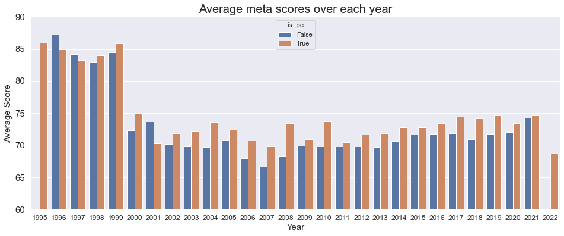

# Milestone 1 (Friday 8th April)

This is the report of milestone 1 in the course [Data visualization](https://edu.epfl.ch/coursebook/en/data-visualization-COM-480) of EPFL.

## Dataset

For this project, we decided to explore [Games of All Time from Metacritic](https://www.kaggle.com/datasets/xcherry/games-of-all-time-from-metacritic). It was found on [Kaggle](https://www.kaggle.com/)

### Data Quality

It contains 8831 different games from [metacritic](https://www.metacritic.com/browse/games/score/metascore/all/all/filtered), and offers us 9 attributes including **user score, meta score, platform information, description, developer, url to game, genre, rating (E, M, T etc), type (multi/single player)** of each game, so it is abundant to be explored. 

From a quick look, it provides data in good quality:
- **`Completeness`**: There is no missing data.
- **`Consistency`**: For each column, data inside is in the same type or format.
- **`Accuracy`**: User score and meta score are all in normal distribution.

### Data Prepossesing

The KEY reason that we selected this dataset is that we found the URL column inside the dataset, from which we could use web crawler to gather **Release Time** of each game! 

By using the time information, we can boost the information contained in the dataset a lot. For example, we can add time-axis on different dimensions, and depict the variation trend, which is very promising! 

Apart from release time, we can also gather other information like the comments from players, but it is not the main part.

Actually, we have collected time information by using Python Crawler, and the code is provided [here]

After colleting release time of each game, we can focus ourselves on data visualization in next two milestones!

## Problematic

### Overview

Through this project, we aim to provide a one-stop webpage with cool interaction that will deliver the interesting information of games evolving through time. 

### Motivation

Our motivation is to enable users to get insights to the dynamic information of game evolution in multiple dimensions at a single stop. The potential user types of our website can be:

- **`Players`**: By selecting rating(Game Target audients), type (multi/single player), genre, and etc, according to their personal preference, they will get some recommendations from our website. Or they just input a name of game(if applicable), and then they can be shown with abundant information related to the game that interests them.

- **`Game Companies`**: Game companies can get insight into the trend of game evolution, so in this case, they can move their targets to a specific direction respect to popular game genre, type and platform. Based on the information we provide, they can set the rules to hire people, like hiring software engineers with the knowledge of popular game platforms and types.

- **`Investors`**: Investors can view all positions or impact of different game companies, so they can make decision from their intuition of the market evolusion. As for the identifies of games, our platform can help investors adapt their attentions.

For all users, we can provide the relationship between user score and meta score, so they can have a better understanding of game scores in other platforms.

### Dimensions

The primary dimension of the visualization is as followings:
- **`Game Description`**: To outline a specific game, we will show the word cloud of this game by collecting information from different axis.
- **`Relationship Analysis`**: We will analyze the relationship between different attributes. For example, would platform affect the score of a game? How much it would affect?
- **`Popularity Analysis`**: We will show changing trend of popularity of game genres, platforms, rating, and developers.

## Exploratory Data Analysis

**`Percentage of top 10 genres`** : The pie chart shows the top-10 most popular game genres (based on the game number produced among all the years). It is apparent from the figures that action game is most popular among all games.

**`Meta-user score regression analysis`** :Regression of meta-score and user-score. All the points are located adjacent on either side of the regression line, which shows that although there are positive correlation between user and expert people's feedback, there are also discrepancies which we want further dig into.

**`Basic statistic for user and meta (expert) score`** :The table shows a basic statistic of user score and meta score for each game including mean, standard deviation, quantile,etc. We found that the user score has larger standard variation value, and also  extreme feedbacks such as a score "2" for a poor game.

**`Platform score rank`** :Rank of different platforms. Nentindo-64 and stadia rank first and second, which outperform all other platforms. We could also observe that some recent console playtforms have higher mean game scores such as "Play-station 5" and "Xbox-series-x", which is in line with current market's trend. ([PS5 Sold Out News](https://www.pushsquare.com/guides/ps5-stock-where-to-buy-playstation-5-and-when-in-march-2022))

**`Platform score distribution`** :Score distribution for platforms, from which we know most games obtain a score between 70 and 85, and the PC is the most common platform for games, followed by Sony's PlayStation4 and PlayStation3

**`Score Distribution for single-player and multi-player game`** : Here we plot the user and meta score distribution for single and multi player games. We could observe two interesting points here:

1. The Meta Score distribution has a gap between the range 60-80, while user score distributed more smoothly.

2. When look at the Kernal Density Estimation (KDE) Curve, we could see that normal Users may prefer give higher scores for single-player games while those "Experts" prefer multi-player games.

   

**`Average meta scores over the years`** : As shown above, the average scores for each year are higher during 1995-1999, which shows that some "old fashion" games are really in favord. Then the average scores go down after the year 2000, which may attribute to the fact that there are more game pipelines appeard, which produce many profit-oriented low-quality games.

> For other pre-analysis of the dataset, please refer to https://github.com/com-480-data-visualization/datavis-project-2022-patricks/blob/main/data_analysis.ipynb

## Related Work
- **`Q1`**: What others have already done with the data?

Recommender System, like the [author](https://game-recommender-engine.herokuapp.com/) of this dataset. Besides, other people may perform Descriptive Analysis and Visualization and EDA-Exploratory Analysis.

- **`Q2`**: Why is your approach original?

We crawled the release date data of the games from orginal websites. The extra information is a good complementary to the original data so that we analyzed the data in a time series and drew some interesting and important fact.

- **`Q3`**: What source of inspiration do you take? Visualizations that you found on other websites or magazines (might be unrelated to your data).

We use pie chart, bar chart and line chart in our analysis. For each kind of the chart, the bar chart uses the height of the column to reflect the differences in data. The naked eye is very sensitive to height difference and the recognition effect is good. Line charts are suitable for large two-dimensional data sets, especially where trends are more important than individual data points. The pie chart shows the proportion of a certain part in the whole.

